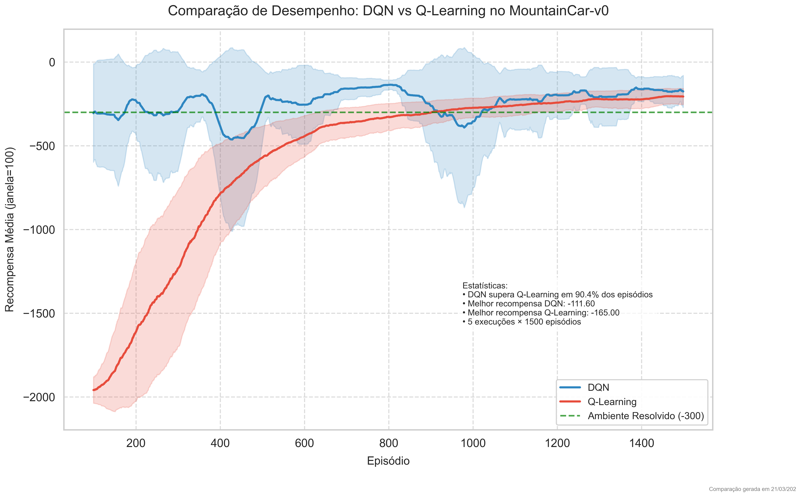

## Relatório de Desempenho: Deep Q-Learning vs Q-Learning no ambiente MountainCar-v0

### Objetivo
Este relatório tem como objetivo comparar o desempenho de duas abordagens de aprendizado por reforço, o método tabular Q-Learning e o método baseado em redes neurais Deep Q-Learning (DQN), utilizando o ambiente MountainCar-v0 da biblioteca Gymnasium.

### Metodologia
Foram realizadas 5 execuções independentes, cada uma com 1500 episódios, para ambos os algoritmos. O desempenho foi avaliado utilizando a média móvel das recompensas obtidas, considerando uma janela de 100 episódios para suavização. Os algoritmos foram comparados quanto à velocidade de convergência, recompensa média alcançada e consistência nos resultados.

### Resultados
- **DQN:**
  - Apresentou maior recompensa média e convergiu consistentemente mais rápido para valores superiores.
  - Obteve melhor recompensa média máxima de **-111,60**.
  - Superou o Q-Learning em aproximadamente **90,4% dos episódios**.
  - Embora tenha sido eficaz, exigiu significativamente mais tempo computacional devido à complexidade da rede neural envolvida.

- **Q-Learning:**
  - Demonstrou eficiência computacional elevada, completando treinamentos rapidamente.
  - Apresentou uma recompensa média máxima de **-165,00**, inferior ao método DQN.
  - Necessitou de um número maior de episódios para alcançar resultados comparáveis ao DQN.

### Análise Gráfica
O gráfico comparativo mostra claramente que, apesar da maior lentidão computacional, o DQN apresenta desempenho significativamente superior ao método tabular do Q-Learning, atingindo rapidamente o critério de resolução do ambiente MountainCar-v0 (recompensa média acima de -300). O Q-Learning demonstrou melhorias graduais ao longo dos episódios, mas não conseguiu atingir recompensas médias comparáveis ao DQN dentro do mesmo número de episódios.

### Conclusão
Com base nos resultados obtidos, o método Deep Q-Learning (DQN) mostrou-se superior em relação ao método tabular Q-Learning para o ambiente MountainCar-v0 em termos de desempenho geral e convergência. Entretanto, é importante considerar que esta superioridade vem ao custo de maior tempo computacional devido à complexidade da rede neural empregada. O método Q-Learning, embora menos eficiente na recompensa obtida, oferece uma alternativa mais rápida computacionalmente e pode ser útil em contextos onde o tempo de processamento é crítico e as exigências de desempenho são menores.

